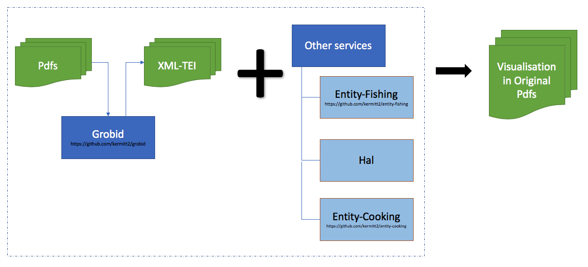
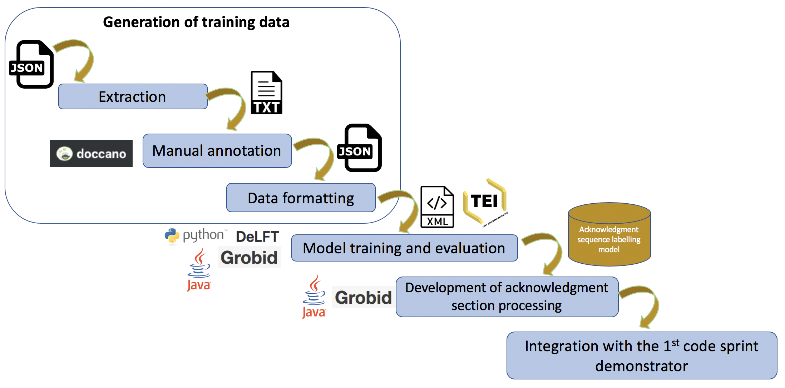
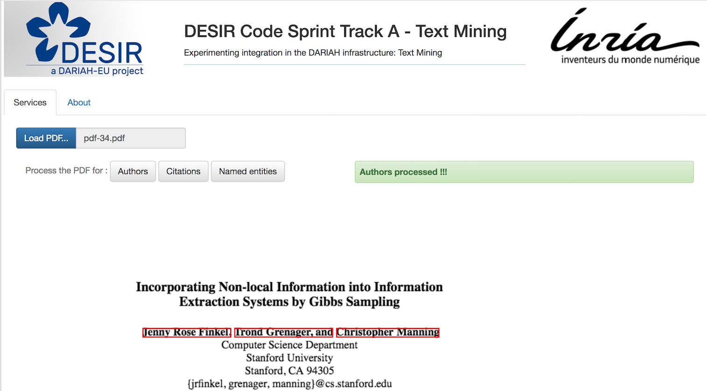
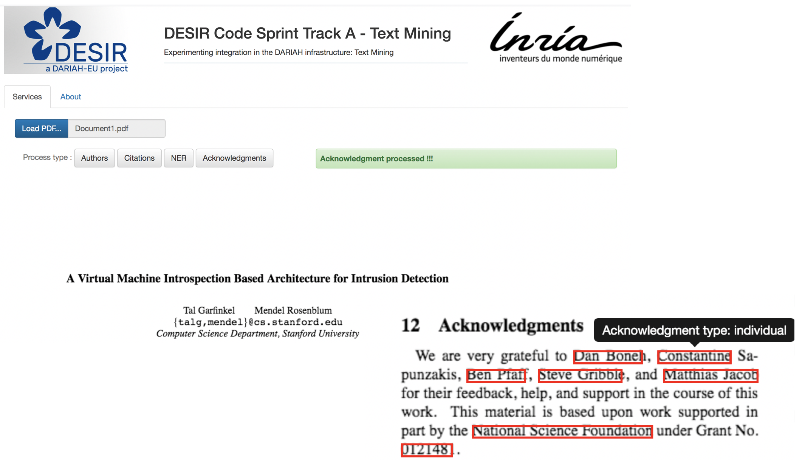

#  Track A 
## Processing of bibliographical data and citations from PDF using GROBID and external DARIAH services :notebook_with_decorative_cover:
This repository contains a workspace and a demonstrator resulting from two code sprints organized by the DESIR project. In order to promote [DARIAH](https://www.dariah.eu/activities/projects-and-affiliations/desir/) tools, services, and initiative collaborations, DESIR organised a series of dissemination events, one of them was the code sprint. The purpose of the [code sprint 2018 & 2019](https://desircodesprint.sciencesconf.org/) was to bring in together developers and affiliates who come not only from the DARIAH community.

The first code sprint took place in Berlin from July 31st to August 2nd 2018 while the second one was held from 24 to 26 September 2019, still in the same city.
 
Under the same main topic *Bibliographical metadata: Citations and References* for both codes sprints, the activities were divided into several tracks. To support the main theme, **track A** focused on the use and the exploration of [Grobid](https://github.com/kermitt2/grobid) as a tool for extracting the bibliographical and citations data of the Pdf scientific files. 

# Goal
### First Code Sprint
The goals of the first code sprints were : 
1) to explore and to improve the usability of Grobid as a tool for extracting Pdf files, particularly scientific articles; 

2) to enrich the extracted data from Grobid with some other information extracted from services other than Grobid; 
    
    Some external services we chose to be integrated were: 
     - [entity-fishing](http://github.com/kermitt2/entity-fishing) a service for extracting and resolving entities against Wikipedia and Wikidata
     - entity-cooking: a (still work in progress) service to disambiguate authors and organisations against [HAL](http://hal.inria.fr)

3) to visualise the extracted data on the Pdf files.  

### Second Code Sprint
The goals of the second code sprints were : 
1) to annotate a new corpus containing **acknowledgment** *sections* of ~ 3500 scientific articles in Open Access;

2) to build a new model for parsing the Aknowledgment section in the Pdf files for GROBID and [DeLFT](https://github.com/kermitt2/delft/); 

3) to create an acknowledgment Web service for Grobid.  

4) to integrate the results of Grobid acknowledgment parser into a demonstrator of Track A.

# Grobid at a Glance
[GROBID](https://github.com/kermitt2/grobid) is a machine learning library for extracting, parsing and re-structuring raw documents, such as PDF documents, into structured TEI-encoded ones. 
Firstly developed in 2008 as a hobby, Grobid has become a state-of-the-art open source library for extracting metadata from technical and scientific documents in PDF format (Lipinski:2013) (Tkaczyk:2018).

With the exploration of a fully automated solution relying on machine learning (Linear Conditional Random Fields) models, Grobid works beyond than just for extracting simple bibliographic, but more than that, it works for reconstructing the logical structure of a raw document needed for large scale advanced digital library processes. 

Grobid's environment includes a comprehensive web service API, a batch processing, a JAVA API, a generic evaluation framework, and the semi-automatic generation of training data. The GROBID Web API provides a simple and efficient way to use. Furthermore, for production and benchmarking, it’s strongly recommended to use this web service mode on a multi-core machine and to avoid running GROBID in the batch mode.

The library is integrated today in various commercial and public scientific services such as ResearchGate, Mendeley, CERN Inspire and the HAL national publication repository in France. It is used on a daily basis by thousands of researchers and engineers. Since 2011, the library is open source under an Apache 2 license.

# Preparation before the track
Track A was prepared to suit the skills available among the participants and was also prepared to a number of frameworks and programming languages (e.g., Java, Python). Participants were asked to prepare their machines before the activities. 

2) For participants who use Java 
   * IDE (e.g. Intellij) 
   * Java 8 (openjdk latest update)
   * Gradle, to build `./gradlew build` 

3) For participants who use Python
   * IDE (e.g. PyCharm)
   * Python 3
   * [Virtualenv](https://virtualenv.pypa.io/en/stable/)
   * The python codes were located under `src/main/python` 
   * The bottle service can be started at `python src/main/python/RootPage.py 8080` 
   * Pip to install dependencies

4) Access to Github services.

# Steps
### First Code Sprint
Steps for the first code sprint :
1) Data extraction by using Grobid (the data contains about 30 science articles in 5 languages and in Pdf format are already prepared. They can be found in `/Pdf Source Files/`)
   * Pdf files extraction into XML-TEI data format
   * Connection and data processing through the REST API
        
2) Visualisation of data extracted from Grobid 
   * Visualisation of the data extracted from the first step in the Pdf  
   * Data enrichment of affiliation, abstract and title data using other services

The results of the demonstrator of the 1st code sprint :

### Second Code Sprint
Steps for the second code sprint :
1) Manual annotation of the corpus file using [Doccano](https://github.com/chakki-works/doccano) 

    A corpus in JSON format containing **acknowledgment** sections from ~ 3500 scientific articles in Open Access has been prepared.

2) Pre-processing of annotated corpus files to be trained and to be evaluated by DeLFT and by Grobid

3) Development of acknowledgment model by DeLFT and Grobid

4) Development of acknowledgment API service for Grobid

5) Integration of acknowledgment parser results into the 1st code sprint demonstrator.

The results of the demonstrator of the 2nd code sprint :

# Demonstrator 
### Run Locally
It's possible to run the demonstrator locally on the default port `8080` by running ApplicationTrackA main class.
1) After cloning this repository `$ git clone https://github.com/DARIAH-ERIC/DESIR-CodeSprint-TrackA-TextMining`
2) Then, run the Java main class`src/main/java/org/dariah/desir/ApplicationTrackA.java`
    or run the gradle `$ ./gradlew run`
Since the demonstrator uses GROBID which has a particular focus on technical and scientific publications, with this reason, in order to use this demonstrator, Pdf files in scientific format are a must.

3) The application is available on the `http://localhost:8080/`

Users can then simply click the buttons available to process the Pdf files according to their needs (author, citation, named-entity recognition, acknowledgment processing).

### Testing
For testing purposes, a demonstrator is available at the following address: [Demonstrator Track A](https://destracka.herokuapp.com/).

## Contact
For more information, do not hesitate to contact us: 
- Luca Foppiano (<luca.foppiano@inria.fr>)
- Tanti Kristanti (<tanti.kristanti@inria.fr>)